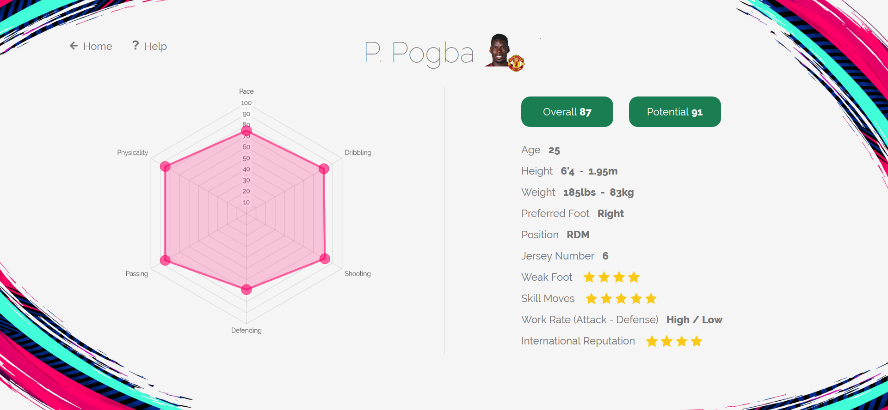

# Fifafinder

User interface on top of [kaggle FIFA 19 complete player dataset](https://www.kaggle.com/karangadiya/fifa19). This webapp was made using [Flask](http://flask.pocoo.org/docs/1.0/).

## Export as .exe

**Step 1**

In the file __ init __.py, uncomment the before last line of the file (which launch the webbrowser on execution) and set the "debug" argument of the run method to "False" in the last line of the file. 

**Step 2** 

In a terminal, activate a venv on which is installed pyinstaller :

    activate *YOUR_VIRTUAL_ENVIRONMENT*
    
Or directly install pyinstaller in the python default environment :

    pip install pyinstaller

**Step 3**
 
Set the project directory as current working directory in a terminal and execute the following line:

    pyinstaller -F --add-data "templates;templates" --add-data "static;static" --add-data "datasets;datasets" --add-data "secret_key.txt;." __init__.py
    
Note: you may have to generate a secret key and write it in the first line of the .txt file called secret_key.txt and located at the root of the project.

The process may last a few minutes. When it's finished, the .exe file will be located in the "dist" directory at the root of the project. You can double click on it from any computer (even if Python is not installed on this computer), it'll launch locally the website on the following address: "http://localhost:5000/".

## Screenshots

